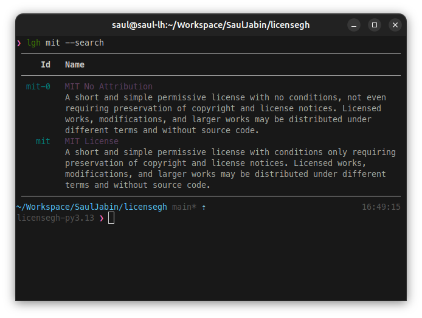
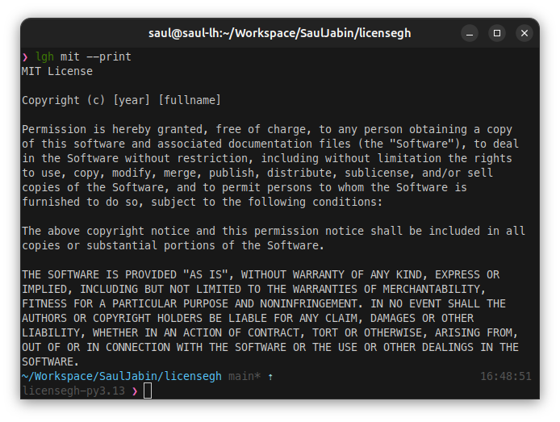

# licensegh

<a href="https://github.com/sauljabin/licensegh/blob/main/LICENSE"></a>
<a href="https://github.com/sauljabin/licensegh/actions/workflows/main.yml"></a>
<a href="https://app.codecov.io/gh/sauljabin/licensegh"></a>
<a href="https://pypi.org/project/licensegh/"></a>
<a href="https://pypi.org/project/licensegh/"></a>
<a href="https://libraries.io/pypi/licensegh"></a>


`licensegh` is a command line tool that generates a license file for a project from the github open source lincese templates

## Installation

Intall with pip:

```sh
pip install licensegh
```

Upgrade with pip:
```sh
pip install --upgrade licensegh
```

## Usage

Help `licensegh -h`:

```sh
Usage: licensegh [OPTIONS] <license id>

Options:
  -p, --print   Print the license file
  -s, --search  Search license, shows a list
  -l, --list    List all found licenses
  --version     Show the version and exit.
  -h, --help    Show this message and exit.
```

List `licensegh -l`:


Search `licensegh -s`:



Print `licensegh -p`:



Save:

```sh
licensegh mit
```

## Development

Install development tools:

- make sure you have `python3.7`, `python3.8`, `python3.9` aliases installed
- install [poetry](https://python-poetry.org/docs/#installation)

Installing development dependencies:

```sh
poetry install
```

Running unit tests:

```sh
poetry run python -m scripts.tests
```

Running multi version tests (`3.7`, `3.8`, `3.9`):

```sh
poetry run python -m scripts.multi-version-tests
```

Applying code styles:

```sh
poetry run python -m scripts.styles
```

Running code analysis:

```sh
poetry run python -m scripts.analyze
```

Running code coverage:

```sh
poetry run python -m scripts.tests-coverage
```

Running cli using `poetry`:

```sh
poetry run licensegh
```
